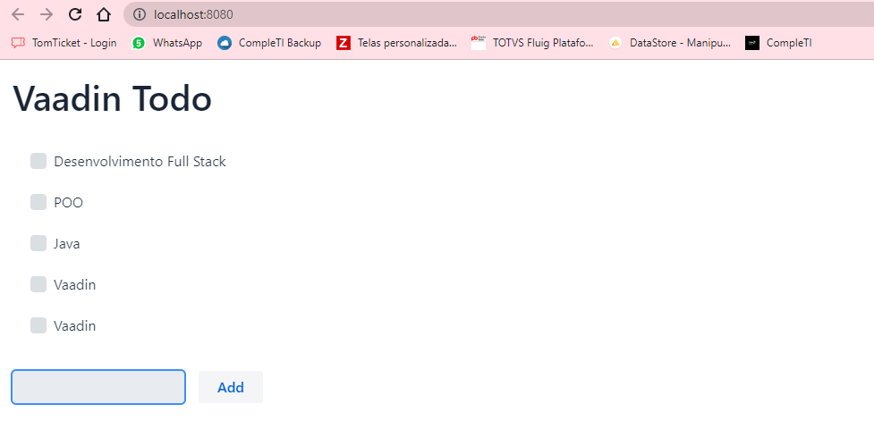

## Utilização do Vaadin

Esse projeto serve de apoio para iniciar um projeto Vaadin.  

### 1° passo: baixe o projeto

Uma opção para iniciar um projeto, é baixar o arquivo disponível em [vaadin.com/docs](https://vaadin.com/docs/latest/)

Para utilizá-lo, é necessário ter JDK 17 ou superior instalado. Caso não possua, está disponível em [oracle.com](https://www.oracle.com/java/technologies/javase/jdk17-archive-downloads.html)

  

### 2° passo: importe o projeto na IDE.

Para importar o projeto na IDE, basta seguir o tutorial disponível na documentação do Vaadin [vaadin.com/docs](https://vaadin.com/docs/latest/guide/step-by-step/importing). Nela está disponível a documentação de importação em cada IDE.

Segue o exemplo de importação no Eclipse:
1. Dentro do eclipse, seleciona a opção **File > Import...**
2. Na janela **Import**, selecione **Maven > Existing Maven Projetcs**, e click em **Next**.
3. Clique em **Browse** e selecione a pasta que contenha seu projeto Vaadin. Em seguida, clique em **Import**

  

### 3° passo: execute o projeto

Existem duas formas de executar o projeto:

A primeira opção é: por ele ser um projeto maven, é possível executá-lo por linha de comando. Basta entrar no diretório do projeto e executar <code>mvnw</code> (Windows) ou <code>./mvnw</code> (macOS ou Linux). Em seguida, abra [localhost:8080](http://localhost:8080/) em seu navegador. 

Outra opção é executá-lo pela IDE, logo após realizar o **2° passso**. Para isso, execute os seguintes passos:
1. Em sua IDE, encontre o arquivo <code>Application.java</code>, localizado em <code>src/main/java/org/vaadin/example</code> 
2. Clique com o botão direito do mouse e selecione **Ruan as > 1 Java Application**
3. Em seguida, abra [localhost:8080](http://localhost:8080/) em seu navegador

  

### 4° passo: use a aplicação

Com a aplicação desse repositório, você obterá a seguinte interface:

Porém, é possível construir diversos outros componentes utilizando a documentação disponível em [vaadin.com/docs](https://vaadin.com/docs/latest/#components).

